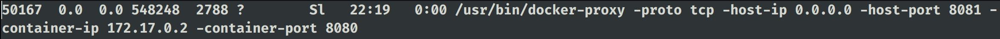

# **Docker - WebProxy**

* **Summary**
    * This docker container has all the pre-requisites to run **JAR** files of **Burpsuite** and **OWASP ZAP**
    * Installed version of **Java** : **OpenJDK-14-JDK** and **OpenJDK-14-JRE**

* **Need**
    * We can run **Burpsuite** or **OWASP ZAP** on local machine without installing **JAVA**
    * This reduced the attack surface and eased Web and Mobile Testing

* **Features**
    * No need to install **JAVA** on local machine. This makes the localhost immune to **JAVA** based attacks
    * Once installed, it will run as if the tool is installed natively
    * **UNIX** and **Docker** sockets are not shared
    * Users can run their favourite proxy by downloading the latest version or any other version of that proxy
      and providing the downloaded path of the proxy which will inturn create a folder in `$HOME/.opt/tools` and
      saves the downloaded proxy file in that path. This path will then be mounted inside docker, so that docker
      can run the **JAR** file
    * Only **JAR's** are supported right now. But we can definitely login to docker and add more things if needed
    * For **GUI**, we have enabled **X11Forwarding**, so that after **SSH**, you can run the proxy directly
    * **Credentials for Docker** : `root:toor` and **SSH** from **root** is enabled considering the local access

> **NOTE** : Have a look at the [**Docker HUB - m2sup3rn0va/docker_proxy**](https://hub.docker.com/r/m2sup3rn0va/docker_proxy) page to understand how the image is created

* **Installation**
    * Let's do some quick updates
        ```sh
        sudo apt-get update
        sudo apt-get install docker docker.io -y

        # Only use below commands if you don't want to use sudo with docker commands
        sudo adduser $USER docker
        newgrp docker
        ```
    * Once done, best is to `logout` or `reboot` once so that the operation on **/etc/group** gets into effect
    * Check whether you are able to run `docker ps -a` without **permission error**. If yes, then we are good to go
      else, you need to visit above steps again or reboot or you can use `sudo docker ps -a`, if that
      works out
    * Now, let's pull our image from **Docker HUB** : `docker pull m2sup3rn0va/docker_proxy:v1`. It's a **440MB**
      file
    * To create container: `/bin/bash build_container`
    * This creates the container with the name **"burp"** which you can check with `docker ps -a` command
    * To start the container : `docker start burp`
    * To start burp inside the container : `/bin/bash docker_start <name_of_the_container>` 
    * When running the proxy for first time, make sure the **Local Proxy IP** is set to **Container's IP Address** and 
      not the **localhost** because then the proxy app will not be able to intercept the traffic from browser as the 
      listening proxy from docker process is running on **Container's IP**. You can check this by `ss -tunlp | grep docker`
      and you will see that docker is listening on `172.17.0.x:8080`

        

    * You will lose your terminal because of proxy running via **X11Forwarding**. Thus, you can hit **"<CNTRL+Z>"**,
      to suspend the process and then once you have the prompt back type : `bg`
    * This will give you terminal as well as your proxy running in the background
    * Once you close the proxy, it kills the background process and closes the **SSH** connection
    * To stop the container: `docker stop zap/burp`
    * To remove the container : `docker rm zap/burp`. You can check all the containers with `docker ps -a`
    * To remove image : `docker rmi <name_of_image>`. You can check all the images with `docker images -a`

> **NOTE**: If you are running **Burpsuite**, then the container name will be **"burp"** else if its **OWASP ZAP**, then the name will be **"zap"**.

> **NOTE**: If the proxy app get stuck and you are not able to close it, type: **fg** on the prompt and close the app
